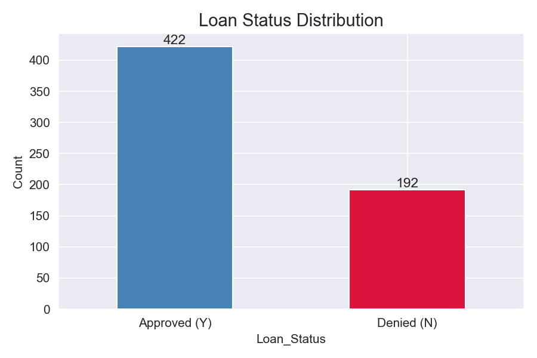
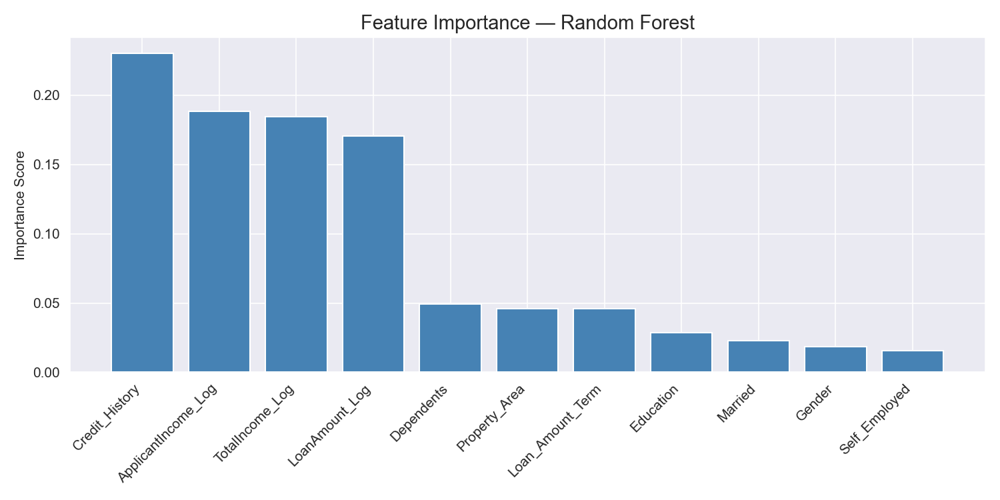
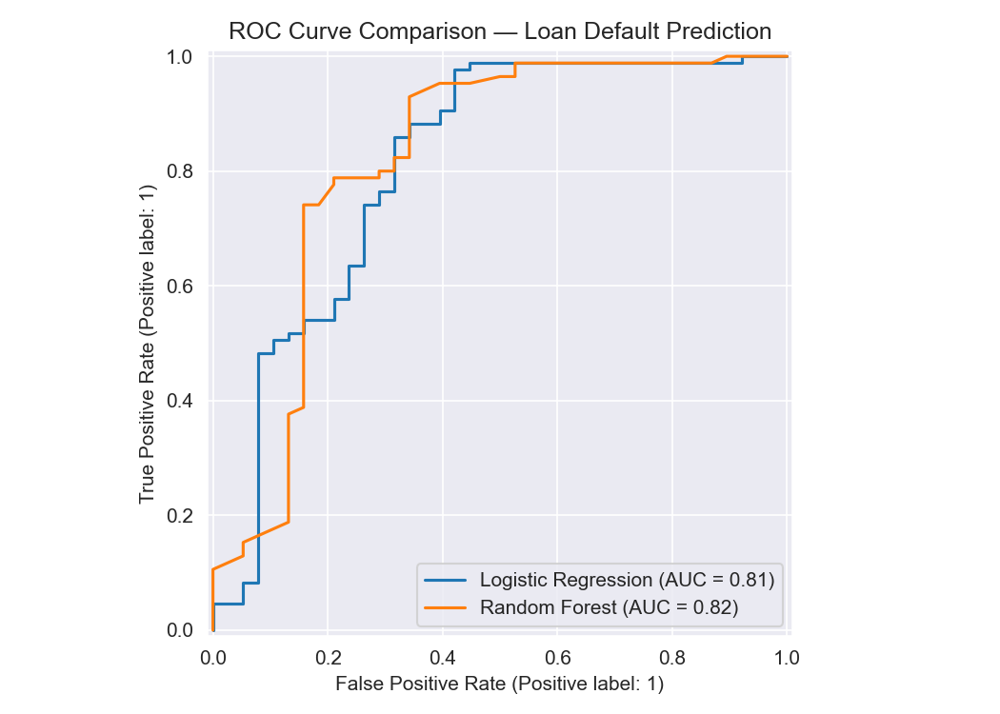
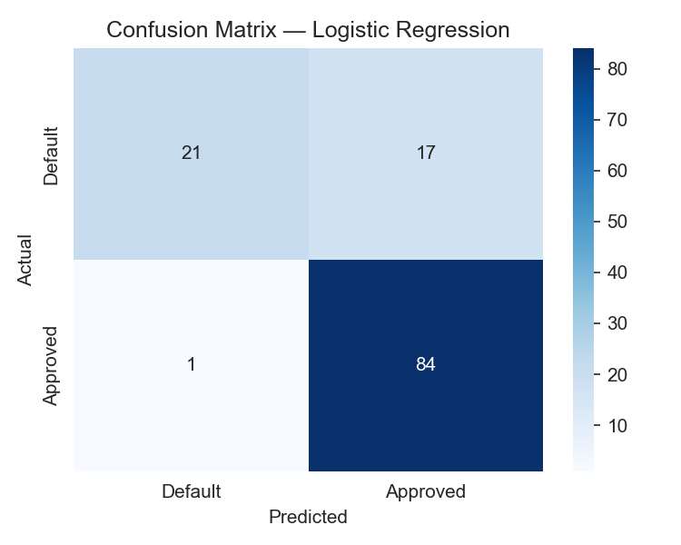
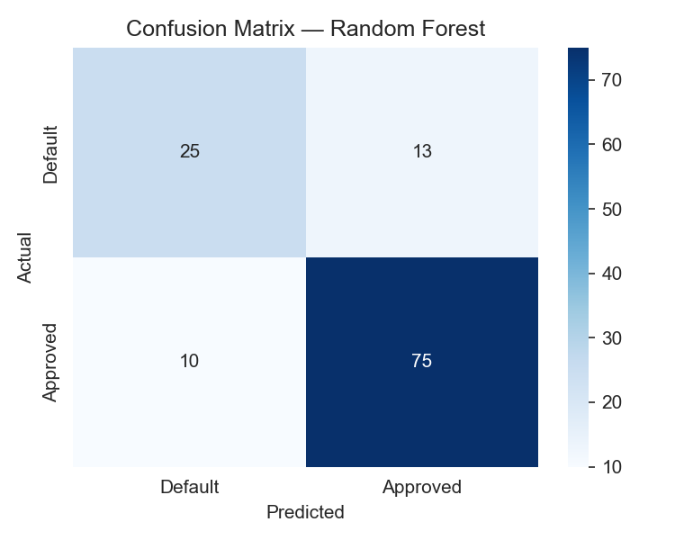

# Loan Default Prediction

A binary classification project predicting loan default risk using applicant demographic and financial data, built with Python and Scikit-learn.

---

## Problem Statement
Lending institutions face significant losses when borrowers default. This project builds and compares machine learning models to predict loan default probability, enabling smarter, data-driven credit decisions.

---

## Dataset
- **Source:** [Kaggle — Loan Prediction Dataset](https://www.kaggle.com/datasets/altruistdelhite04/loan-prediction-problem-dataset)
- **Size:** 614 applicants, 13 features
- **Target:** Loan_Status (Y = Approved, N = Denied)

---

## Tools & Libraries
- Python 3.x
- Pandas, NumPy
- Matplotlib, Seaborn
- Scikit-learn

---

## Project Workflow
1. Exploratory data analysis — approval rates, income distributions, correlations
2. Preprocessing — missing value imputation, log transformation, label encoding
3. Feature engineering — total income, log-scaled loan amount
4. Modeling — Logistic Regression and Random Forest with 5-fold cross-validation
5. Evaluation — confusion matrix, classification report, ROC-AUC, feature importance

---

## Key Findings
- **Credit history** was the single strongest predictor of loan approval — consistent with real-world lending practices
- Random Forest outperformed Logistic Regression on cross-validation ROC-AUC (0.77 vs 0.71) with lower variance between folds, making it the more reliable model for unseen data
- Logistic Regression caught fewer defaulters (recall 0.55) despite high precision (0.95) — missing 45% of actual defaults is a significant risk in a real lending environment
- Graduates had a higher loan approval rate than non-graduates
- Both models highlight the danger of optimizing for accuracy alone — Logistic Regression's 85% accuracy masks its failure to catch nearly half of all defaulters

---

## Visualizations

### Loan Status Distribution

### Feature Importance

### ROC Curve Comparison

### Confusion Matrices

---

## Limitations & Next Steps
- Small dataset (614 rows) may limit generalizability
- Future work: XGBoost, SHAP explainability, threshold tuning

---

## How to Run This Project
1. Clone the repository
2. Download `train.csv` from [Kaggle](https://www.kaggle.com/datasets/altruistdelhite04/loan-prediction-problem-dataset)
3. Place `train.csv` in the root project folder
4. Install dependencies: `pip install pandas numpy matplotlib seaborn scikit-learn`
5. Open `loan_default_prediction.ipynb` in Jupyter or VS Code and run all cells

---

## Author
**Mihrimah Qozat**
[LinkedIn](https://linkedin.com/in/mihrimah-qozat/) | [GitHub](https://github.com/mihrimahqozat)
